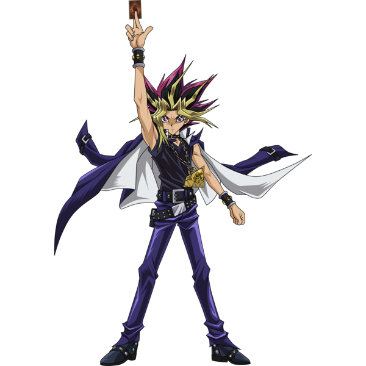

# YugI-Monster-Love

<h1>Yugi, to be my sweetheart!!!</h1>

What is love? Will this question ever be answered? No, no it wil not. However, You can take my Yu-Gi-Oh! monster match test to see with which sexy monster you would pair best.

<h2>game logic-</h2>

<ul>
<li>User will choose from questions</li>
<li>Each question has a value based on the assumed personality of the character</li>
<li>After completing the test a box will show the results</li>
</ul>

<h2>How to get started</h2>
<ol>
    <li>Press  "Begin Duel!"<h1>
</ol>

<h3>Credits</h3>
<ul>
<li>Robert Castor</li>
<li>Brittany Morataya(leader)</li>
<li>Jeremy Taubman(helped several times)</li>
<li>Hayk Mnatsakanyan(helped several times)</li>
<li>ChatGPT</li>
</ul>

<h1>Thank you to all that helped me with this project. Your help is greatly appreciated!</h1>

 
